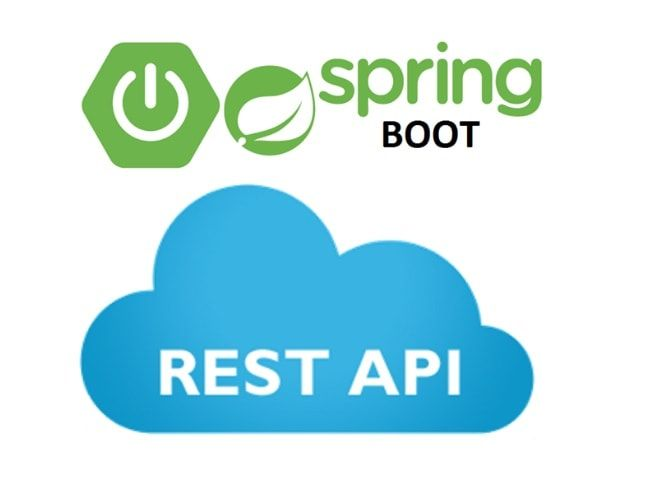
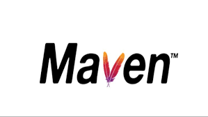

# Coffee machine rest
## Simple spring boot rest app

</br>

Приложение представляет из себя REST-сервис, который является 
backend-частью проекта "CoffeeMachineApp" и предоставляет
инофрмацию о различных напитках, гипотетически предоставляемых
кофе машиной, работу которой имитирует приложение.

## Разграничение доступа
Для ограничения доступа сервис использует CORS.

## Запуск проекта
</br>
Так как у проекта есть POM, он может быть запущен с помощью
Maven из командной строки
```
...\CoffeeMachineRest>mvn spring-boot:run
```
Также проект может быть запущен с помощью IntellijIDEA прямо
из класса Spring boot приложения:
```
@SpringBootApplication
public class CoffeeMachineRestApplication {
    public static void main(String[] args) {
        System.out.println("Started...");
        SpringApplication.run(CoffeeMachineRestApplication.class, args);
    }
}
```
При запуске необходимо убедиться, что запущен mysqld, а параметры
для взаимодействия backend-части с БД в конфигурационном файле
`...\CoffeeMachineRest\src\main\resources\application.properties`
настроены в соответствии с параметрами местного mysqld.</br>
1. spring.datasource.url=jdbc:mysql://${MYSQL_HOST:localhost}:3306/
   `Your mysql database name`?useUnicode=true&useJDBCCompliantTimezoneShift=true&use
   LegacyDatetimeCode=false&serverTimezone=UTC
2. spring.datasource.username=`Your mysql user name`
3. spring.datasource.password=`Your mysql user password`
4. spring.jpa.database-platform=org.hibernate.dialect.MySQL`Your mysql version`Dialect

После старта проекта, обратиться к нему можно по адресу
`http://localhost:8080`